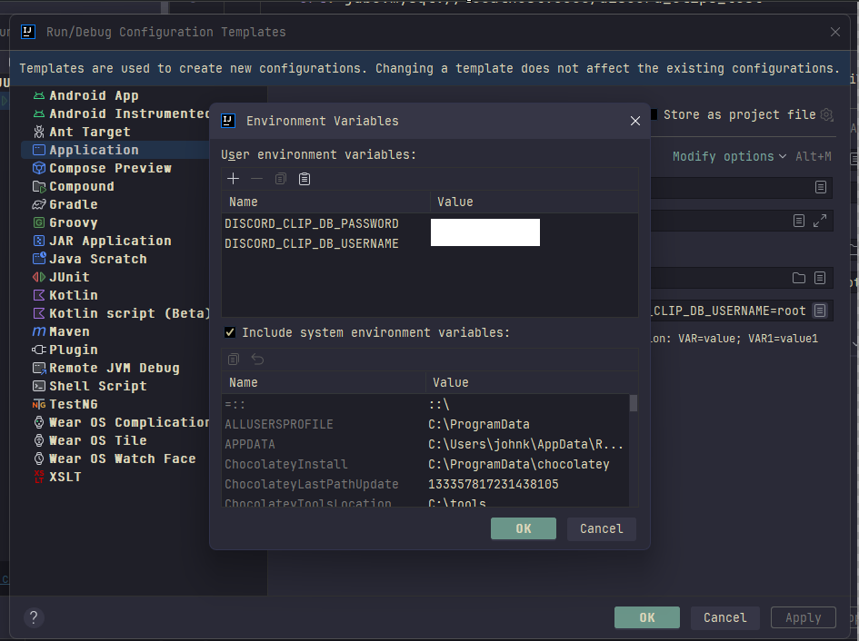
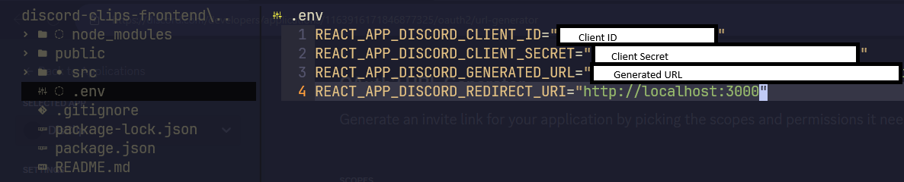
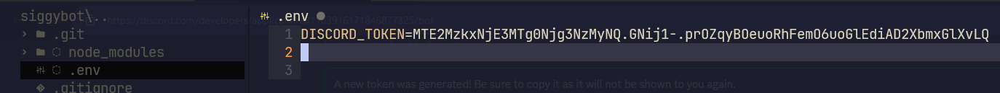

# Set Up

## discord_clips Database
- Open MySQL Workbench and connect
- Open directory `/discord-clips/discord-clips-backend/sql`
- Open and execute [discord-clips-schema-test.sql](../discord-clips-backend/sql/discord-clips-schema-test.sql)
- Open and execute [discord-clips-schema-prod.sql](../discord-clips-backend/sql/discord-clips-schema-prod.sql)

## discord-clips-backend
- Open backend project `/discord-clips/discord-clips-backend` with IntelliJ
- Make sure to reload `Maven` project
- Go to `Main Menu > Run > Edit Configurations > Edit configuration templates...`
    - Select `Application` and enter your DB credentials
    - Repeat for `JUnit`
        - 
- Run all tests to make sure everything is set up correct
- Run the application

## Disclip Discord Application
- [Log in to your Discord Developer Portal](https://discord.com/developers/applications)
- Click on `New Application`, I named it `DisClip`
- Click on `OAuth2`
    - General
	    - Save `Client ID`
	    - Save `Client Secret`
	    - Enter `http://localhost:3000` into `Redirects`
    - URL Generator
        - Check `identify` and `guilds`
        - Select `http://localhost:3000` for `Select Redirect Url`
        - Save the `Generated URL`

## discord-clips-frontend
- Open any terminal
- Relocate to frontend project `/discord-clips/discord-clips-frontend`
- Create `.env` file and enter in 
    - `REACT_APP_DISCORD_CLIENT_ID`
    - `REACT_APP_DISCORD_CLIENT_SECRET`
    - `REACT_APP_DISCORD_GENERATED_URL`
    - `REACT_APP_DISCORD_REDIRECT_URI`
    
- Install JavaScript packages with `npm install`
- Run the application with `npm start`

### Things to Note

#### Sidebar
- `Playlists` and `Servers` does not automatically update on the `Sidebar` when a user adds/removes a playlist, or joins/leaves a server. The user has to log back in for it to update

#### Click to Enable/Disable
- this feature has not been implemented
- you will have to update from the backend to `enable/disable` a clip

#### Create/Edit a Clip
- Volume adjustment has yet to be implemented and will always be a value of `1.0`
- `BUG`: `Volume`, `Start Time`, `Duration`, and `Playback Speed` all round to an integer
- `BUG`: Upon first loading, the video pauses `0.5 seconds` too early. Replay for the `real` clip.

## SiggyBot Prototype
- `NOTE`: This does not currently work with my frontend/backend application
- `NOTE`: This is meant as a proof of concept, to show that a Discord Bot can play a YouTube clip upon entering a voice channel

### Set Up Discord Bot
- [Log in to your Discord Developer Portal](https://discord.com/developers/applications)
- Click `OAuth2`
    - Save your `Client ID`
    - Open the following link to add bot to your server, replacing `CLIENT_ID` with the Client ID we saved
        - `https://discord.com/api/oauth2/authorize?client_id=CLIENT_ID&permissions=3146752&scope=bot%20applications.commands`
- Click `Bot`
    - Click `Reset Token`
    - Save your `Token`

### Launch Discord Bot
- Open any terminal
- Relocate to frontend project `/discord-clips/siggybot`
- Create `.env` file and enter in 
    - `DISCORD_TOKEN`
    
- Run bot with `npx ts-node index.ts`
